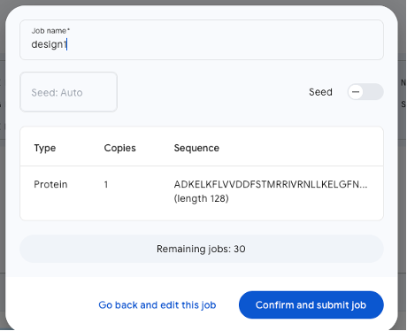
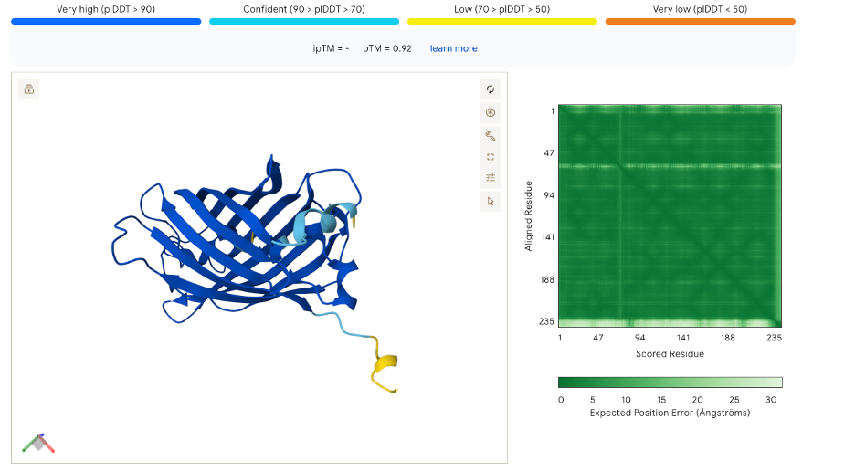

# Assignment 1: Finetuning ProGen2 on Green Fluorescent Protein

ProGen2 is a foundation model for protein design. For detailed information, please check [paper](https://www.cell.com/cell-systems/fulltext/S2405-4712(23)00272-7)

In this assignment, you'll learn how to finetune the pretrained ProGen2 model on a specific protein family, e.g., green fluorescent protein.
Then you'll need to apply AlphaFold3 metrics to select good candidates which are highly potential to 
have the desired function from your finetuned model.


## Environment Setup

The starting code base is provided in [GenAIBioMed/Assignment1.git](https://github.com/GenAIBioMed/Assignment1.git).

**Prerequisites:** You'll need a GPU to complete this assignment. We recommend PSC supercomputing center, which has already provided to you.

The environments to finetune the model and generate proteins are provided below. 
Please make sure your python version is 3.9+.

```bash
python3 -m venv progen 
source progen/bin/activate 
pip install torch==2.7.0 torchvision==0.22.0 torchaudio==2.7.0 --index-url https://download.pytorch.org/whl/cu128
pip install transformers==4.49.0
```

If you choose to use anaconda, run the following command:

```bash
conda create -n progen python=3.9.16 -y 
conda activate progen 
pip install torch==2.7.0 torchvision==0.22.0 torchaudio==2.7.0 --index-url https://download.pytorch.org/whl/cu128
pip install transformers==4.49.0
```

## Downloading Pretrained models

To prepare the pretrained model for subsequence finetuning process, 
please run the following command:

```bash
mkdir pretrained_model
mkdir models
mkdir pretrained_model/progen2-small
cd pretrained_model/progen2-small
wget https://storage.googleapis.com/sfr-progen-research/checkpoints/progen2-small.tar.gz
tar -xvzf progen2-small.tar.gz
```

## Finetuning

We already provided the full training pipeline. What you need to do 
is finish the TODO modules in the current code. If you have problem in filling the code,
please refer to the hints. Please **Don't change the other parts, especially the seed and the hyperparameters we give notes for.**


After filling all the core code lines, please follow the command below to finetune the model: 

```bash
python train.py
```

## Design

After finetuning the model, we use the best checkpoints from your finetuning process to design functional green fluorescent proteins.
To achieve this goal, we'll provide the first 64 tokens as the prompt to the model and then the finetuned model will generate a full protein
sequence autoregressively conditioned on the provided prompt. To achieve design, just follow the command below:

```bash
python inference.py
```

## Candidate Selection

After generating a set of candidates, we will select high-quality candidates using AlphaFold3 metrics.

For AlphaFold3, you can either use the code from the [GitHub repo](https://github.com/google-deepmind/alphafold3) or use their web server. 

If you choose to use the GitHub repo, please follow their official guidelines. 

If you choose to use the web server, please follow the instruction below:

### Running AlphaFold3 Evaluation

The AlphaFold3 website server is at [link](https://alphafoldserver.com/). 
To run the evaluation, follow the instruction below:

(1) Register an account using your gmail account

(2)	Input your designed sequence to the protein field as below:


(3) click continue and preview job, and then click Confirm and submit job:



(4) After waiting some time, you’ll have the results:



(5) Among all the designed sequences, rank them according to their pLDDT scores, which can be calculated based on the folded structure

(6) Find the top-5 candidates with the highest pLDDT, of which the pTM scores should be higher than 0.8. If not, there might be something wrong with your finetuning process


## Submit Your Results

Please compress all the results into a zip file, and the results should include:

(1)	**The fully filled code**. Note don’t submit the data but only submit the python files

(2)	**A PDF file for the top 5 candidate report**. Please include the detailed information about your top-5 candiates, including the Alphafold3 visualization, sequences, pTM score, pLDDT score, and provide an explanation of these metrics.
